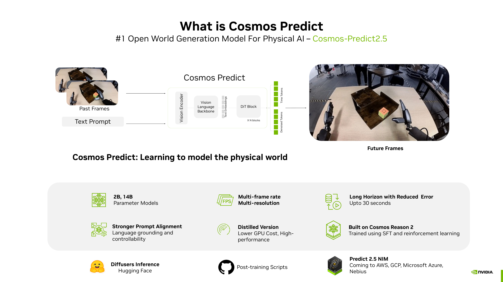
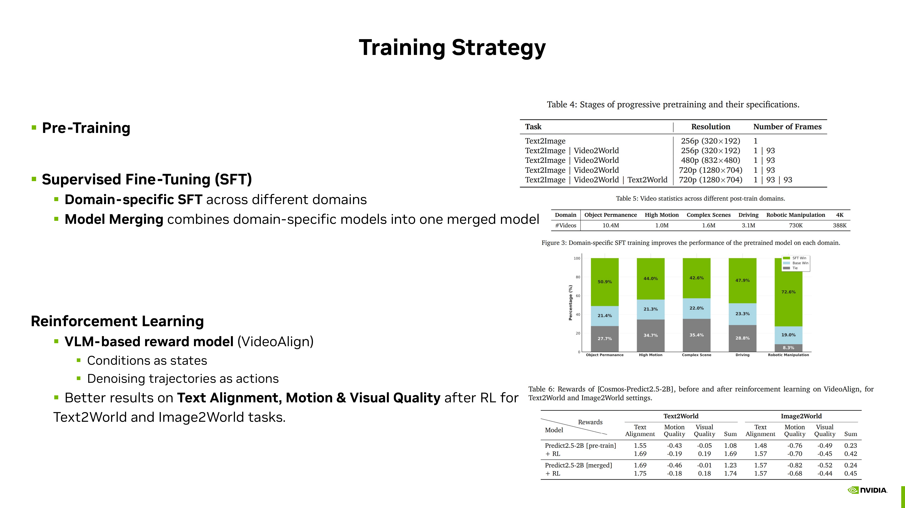
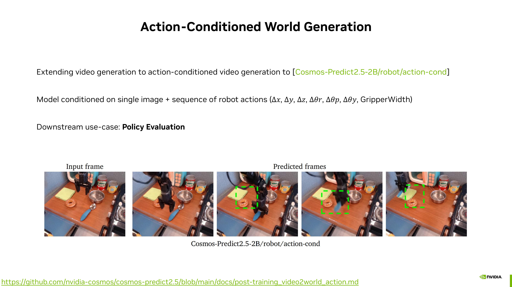
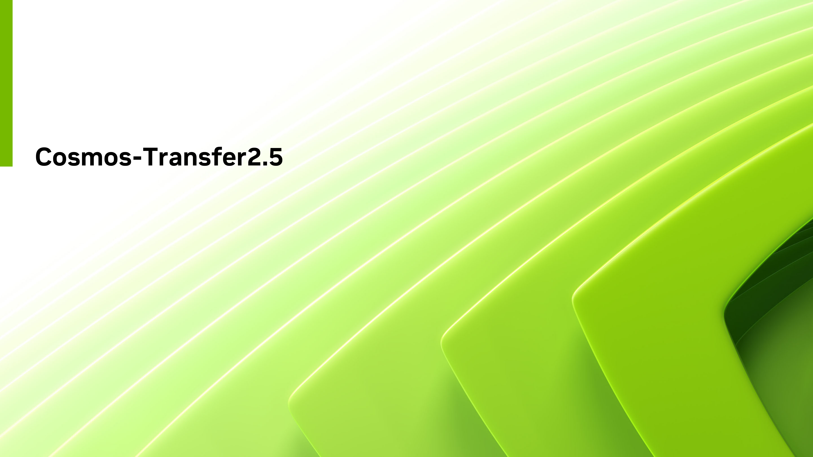
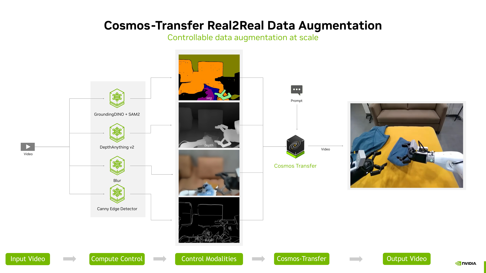

# UT Austin x NVIDIA Robotics Tech Day — Talk Materials

This repository contains the open-source slide deck for the talk **"Cosmos World Foundation Models for Physical AI,"** delivered at NVIDIA Robotics Day @ UT Austin (April 13, 2026).

**Slides:** [NV Tech day - Cosmos master - 20260412.pdf](NV%20Tech%20day%20-%20Cosmos%20master%20-%2020260412.pdf)

---

## The Core Problem: Physical AI Needs Scalable Data

Robots still fail because physical AI is fundamentally a **general intelligence problem** — spanning factories, automotive, humanoids, and smart cities. The common challenge across all embodiments is understanding real-world dynamics.

Unlike language and vision AI, physical AI faces a critical **data gap**: internet-scale video pretraining only goes so far, and human demonstration data is expensive and scarce. Scaling to the physical world requires a third path — **synthetic data generation** grounded in physical laws.

NVIDIA Cosmos is the answer: an open platform of world foundation models that generate, augment, and reason about the physical world — giving robot learning the data substrate it needs to scale.

---

## What's in the Deck

The talk covers four components of the Cosmos platform:

### Cosmos-Predict2.5 — World Generation for Policy

**#1 open world generation model for Physical AI.** Cosmos-Predict takes past video frames and a text prompt and generates physically plausible future frames — learning to model how the world evolves.

Key capabilities:
- **2B and 14B** parameter variants; one model handles Text2World, Image2World, and Video2World
- **Multi-frame rate, multi-resolution** up to 720p; long-horizon generation up to 30 seconds
- **Trained with flow matching** on 35M hours of video (200M curated clips across robotics, driving, human dynamics, physics domains)
- **Three-stage training**: pretraining → domain-specific SFT with model merging → RL with VLM-based reward (VideoAlign)
- **Post-training ready**: LoRA, DMD2, and post-training scripts open-sourced; NIM coming to AWS, GCP, Azure, Nebius
- **6M+ downloads** on Hugging Face

**Multi-view generation with camera control** — synthesize additional camera views from a reference, conditioned on camera intrinsics and extrinsics:

**Action-conditioned world generation** — condition on a robot action sequence (Δx, Δy, Δz, Δθr, Δθp, Δθy, GripperWidth) to roll out predicted future frames. Downstream use: **policy evaluation without deploying to hardware**:

Adopters include: AGiBot, FieldAI, GALBOT, J&J MedTech, NVIDIA Gear Lab, Nexar, PlusAI, Toyota Research Institute.

---

### Cosmos-Transfer2.5 — Sim-to-Real and Real-to-Real

**Photorealistic data augmentation at scale.** Cosmos-Transfer bridges the visual gap between simulation and the real world — turning structured, controllable synthetic scenes into photorealistic training data.

**Sim-to-Real with NVIDIA Omniverse:**

Real-world data → USD → Omniverse (structured 3D) → Cosmos Transfer → photorealistic output, with prompt-conditioned environment, weather, and lighting control.

**Transfer capabilities** — multiview transformation, sim-to-real stylization, and image-to-world expansion:

**Real2Real data augmentation** — a fully controllable pipeline for augmenting real robot video:

Input video passes through control extractors (segmentation via GroundingDINO + SAM2, depth via DepthAnything v2, blur, Canny edges), then Cosmos-Transfer generates photorealistic output video conditioned on those control signals and a text prompt.

Adopters include: CARLA, Gatik, Li Auto, PlusAI, OXA, VOXEL51, X-HUMANOID.

---

### Cosmos-Reason2 — Physical AI Reasoning VLM

**#1 physical AI reasoning vision-language model.** Cosmos-Reason2 is the reasoning backbone that powers Cosmos-Predict2.5's text encoder, and serves as a standalone VLM for spatial and physical scene understanding.

---

### Cosmos Curator — Data Pipeline at Scale

End-to-end video curation pipeline for training world models: shot-aware splitting, GPU-based transcoding, multi-filter quality pipeline (aesthetic, motion, OCR, perceptual, semantic artifacts, VLM), semantic deduplication, and sharding — turning raw unstructured video into annotated, deduplicated training datasets.

---

## About the Event

This talk was part of a full-day event co-hosted by UT Austin and NVIDIA, focused on Physical AI and robot learning. The day included an NVIDIA robotics technology overview, researcher lightning talks from UT Austin labs working across manipulation, locomotion, and navigation, a hands-on sim-to-real RL lab for gear insertion run on UT Austin's Blackwell cluster at TACC, and an overview of NVIDIA's academic ecosystem programs (Academic Grant Program, Inception, Teaching Kits). Compute access was provided via BREV and the Texas Robotics cluster at TACC.

---

## Why This Repo

The slides are shared openly so anyone working in physical AI, robot learning, or world models can engage with the material independently of the live talk. If you're using or evaluating Cosmos for your research, feel free to open an issue or reach out — happy to connect.
